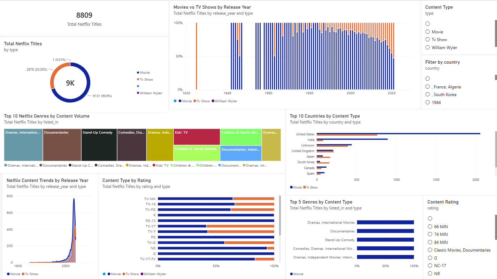

# SWYNEX-Final-Data-Analytics-Project
# Netflix Content Analytics – End-to-End Data Analytics Project

## Project Overview

This project was completed as part of my **Data Analyst Internship at SWYNEX Technologies**.

The project focuses on analysing a Netflix dataset and transforming the raw data into meaningful insights through data cleaning, exploratory data analysis (EDA), and an interactive Power BI dashboard.

The main goal of this project was to understand Netflix content based on content type, country, ratings, genres, and release years, and present the findings in an easy-to-understand dashboard.

---

## Problem Statement

The Netflix dataset contains information about movies and TV shows, including their titles, directors, cast, countries, ratings, genres, release years, and other details.

The objective of this project was to:

* Clean and prepare the raw Netflix dataset
* Explore the dataset and identify useful patterns
* Analyse Netflix content using different categories
* Create meaningful visualizations
* Build an interactive Power BI dashboard
* Identify key insights from the data
* Present the complete analytics process as an end-to-end project

---

## Dataset Information

The dataset contains information about Netflix movies and TV shows.

### Main columns used:

* `show_id` – Unique ID of the title
* `type` – Movie or TV Show
* `title` – Title of the content
* `director` – Director of the content
* `cast` – Cast members
* `country` – Country associated with the content
* `date_added` – Date the content was added to Netflix
* `release_year` – Release year
* `rating` – Content rating
* `duration` – Duration of the content
* `listed_in` – Genre/category
* `description` – Description of the content

The cleaned dataset contains **8,809 Netflix titles**.

---

## Data Cleaning and Preparation

The dataset was cleaned and prepared before performing the analysis.

The main steps included:

* Loading the Netflix dataset
* Checking the structure of the dataset
* Identifying missing values
* Checking for duplicate records
* Removing duplicate records using `show_id`
* Handling missing and inconsistent values
* Cleaning column data
* Preparing the dataset for analysis and visualization
* Saving the cleaned dataset for further analysis

The cleaned dataset was then used for Exploratory Data Analysis and the Power BI dashboard.

---

## Exploratory Data Analysis (EDA)

After cleaning the data, Exploratory Data Analysis was performed to understand the Netflix content and identify patterns.

The analysis focused on:

* Distribution of Movies and TV Shows
* Content by release year
* Country-wise content
* Content ratings
* Genre/category distribution
* Overall number of Netflix titles
* Patterns and trends in the dataset

EDA helped in understanding the dataset before creating the final dashboard.

---

## Power BI Dashboard

An interactive **Netflix Content Analytics Dashboard** was created using Microsoft Power BI.

### Dashboard includes:

* **Total Netflix Titles** – KPI showing the total number of titles
* **Netflix Content Distribution by Type** – Movies vs TV Shows
* **Titles by Release Year** – Shows content trends across release years
* **Top 10 Countries by Title Count**
* **Netflix Titles by Rating**
* **Netflix Titles by Genre**
* **Top 10 Netflix Genres by Content Volume**

### Interactive Filters

The dashboard also includes slicers that allow users to filter the data based on:

* Content Type
* Content Rating
* Country

These filters make it easier to explore the Netflix dataset interactively.

---

## Key Business Insights

Some of the key insights identified from the analysis include:

* Netflix contains a larger number of **Movies compared to TV Shows** in the analysed dataset.
* Netflix content comes from many different countries, showing the global nature of the platform.
* The dataset contains a wide range of content ratings suitable for different audiences.
* Different genres contribute significantly to the overall Netflix content library.
* The release-year analysis helps understand how the Netflix content library has developed over time.
* Interactive filters make it easier to compare Netflix content across different types, ratings, and countries.

---

## Tools and Technologies Used

* **Python**
* **Pandas**
* **NumPy**
* **Jupyter Notebook / Google Colab**
* **Power BI**
* **Power Query**
* **DAX**
* **GitHub**

---

## Project Workflow

```text
Raw Netflix Dataset
        ↓
Data Cleaning & Preparation
        ↓
Exploratory Data Analysis
        ↓
Data Visualization
        ↓
Power BI Dashboard
        ↓
Business Insights
        ↓
Final Analytics Case Study
```

---

## Dashboard Preview



---

## Project Files

| File                                        | Description                    |
| ------------------------------------------- | ------------------------------ |
| `SWYNEX_Netflix_Data_Cleaning.ipynb`        | Data cleaning and preparation  |
| `SWYNEX_Netflix_EDA.ipynb`                  | Exploratory Data Analysis      |
| `SWYNEX_cleaned_netflix_dataset.csv`        | Cleaned Netflix dataset        |
| `SWYNEX_Netflix_Interactive_Dashboard.pbix` | Power BI interactive dashboard |
| `Netflix_Dashboard_Preview.png`             | Dashboard preview image        |

---

## Skills Gained

Through this project, I gained practical experience in:

* Data Cleaning
* Data Preprocessing
* Exploratory Data Analysis
* Data Visualization
* Power BI Dashboard Development
* Power Query
* DAX
* Business Insights
* GitHub Project Documentation

---

## Internship

This project was completed as part of my **Data Analyst Internship at SWYNEX Technologies**.

The project helped me apply data analytics concepts to a real-world dataset and understand the complete workflow from raw data to meaningful business insights.

---

## Conclusion

This project demonstrates an end-to-end data analytics workflow using the Netflix dataset. From cleaning and analysing the data to building an interactive Power BI dashboard, the project helped transform raw data into meaningful and easy-to-understand insights.

It was a valuable learning experience and helped me improve my practical skills in **data analytics, visualization, Power BI, Python, and business intelligence**.
